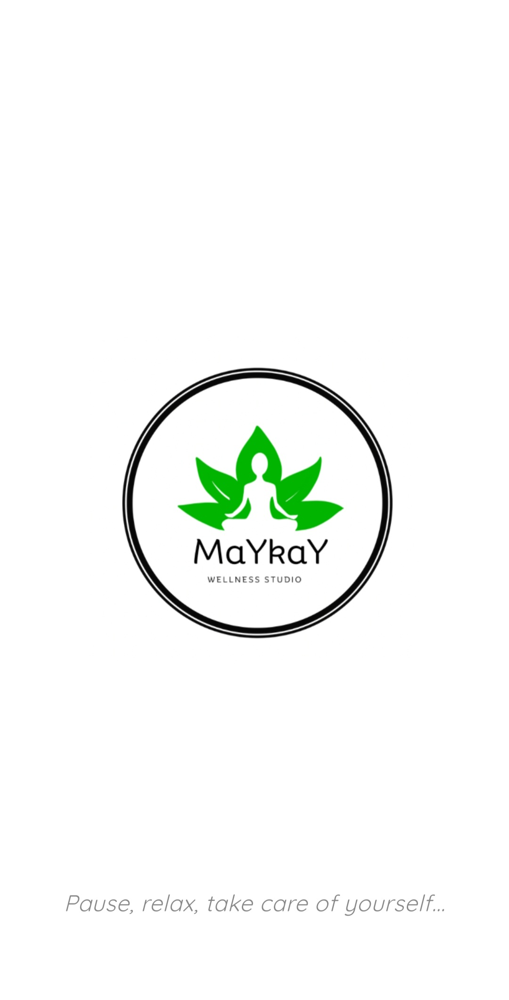
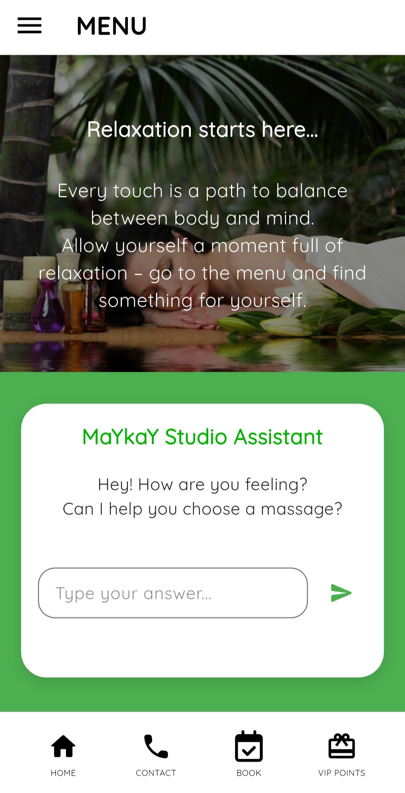
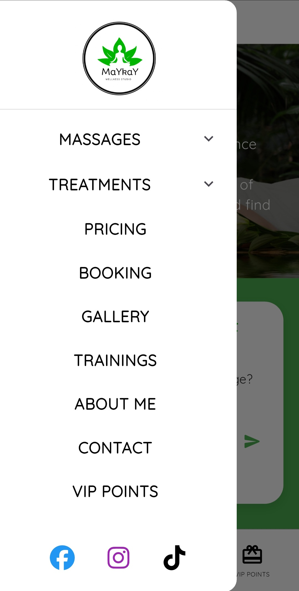
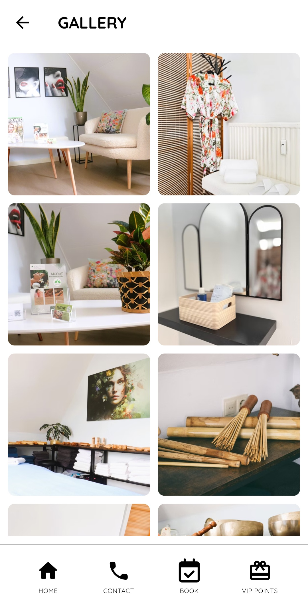
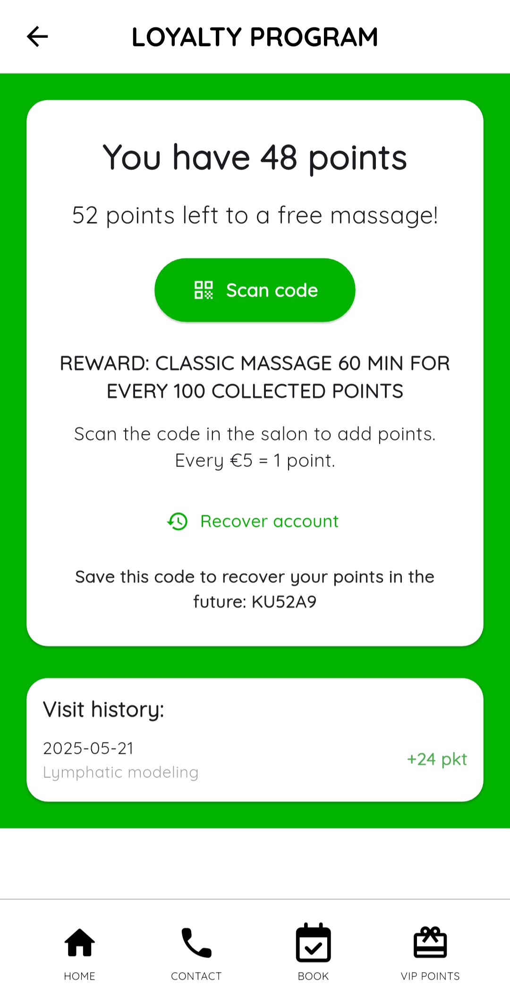

# Maykay

MaYkaY is a Flutter-based mobile app created for massage and wellness studios, designed to enhance the experience of relaxation, self-care, and client loyalty.  
It allows users to discover treatments, book massages, collect loyalty points, and stay connected with the studio — all in one elegant, minimalist app.

Built with a clean and calm design using white and green tones, MaYkaY offers a professional yet soothing interface for both Android and iOS.

---

## ✨ Features

- **Massages & Treatments** – browse the full offer with clear descriptions.  
- **Online Booking** – schedule your session directly through the app.  
- **Loyalty Program** – scan codes to collect points and earn free massages.  
- **AI Massage Assistant** – get personalized suggestions based on your needs.  
- **Gallery** – preview the relaxing atmosphere of the studio.  
- **Multilingual** – available in English, Dutch, and Polish.  
- **Push Notifications** – stay informed about promotions and updates.  
- **Modern UI/UX** – fresh, minimalist layout designed for calmness.  

---

## 📱 Screenshots

| Splash | Welcome | Home |
|--------|----------|------|
|  |  |  |

| Drawer Menu | Gallery | Loyalty Program |
|-------------|----------|-----------------|
|  |  |  |

---
